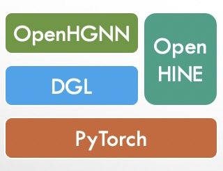

# OpenHGNN
This is an open-source toolkit for Heterogeneous Graph Neural Network(OpenHGNN) based on [DGL [Deep Graph Library]](https://github.com/dmlc/dgl). We integrate SOTA models of heterogeneous graph.

[Test Version]For now, we just release some models for some researchers to run the experiments.

[Release Plan]We want to release version0.1 in September.

## Key Features

- Easy-to-Use: OpenHGNN provides easy-to-use interfaces for running experiments with the given models and datasets using [optuna](https://optuna.org/) which is a hyperparameter optimization framework.
- Extensibility: User can define customized task/model/dataset to apply new models to new scenarios.
- Efficiency: The backend dgl provides efficient APIs.

## Get Started

#### Requirements and Installation

- Python  >= 3.6
- [PyTorch](https://pytorch.org/get-started/locally/)  >= 1.7.1
- [DGL](https://github.com/dmlc/dgl) >= 0.7.0

- CPU or NVIDIA GPU, Linux, Python3

**1. Python environment (Optional):** We recommend using Conda package manager

```bash
conda create -n openhgnn python=3.7
source activate openhgnn
```

**2. Pytorch:** Install [PyTorch](https://pytorch.org/). We have verified GraphGym under PyTorch 1.8.0. For example:

```bash
# CUDA versions: cpu, cu92, cu101, cu102, cu101, cu111
pip install torch==1.8.0+cu101 -f https://download.pytorch.org/whl/torch_stable.html
```

**3. DGL:** Install [DGL](https://pytorch-geometric.readthedocs.io/en/latest/notes/installation.html), follow their instructions. For example:

```
# CUDA versions: cpu, cu101, cu102, cu110, cu111
pip install --pre dgl-cu101 -f https://data.dgl.ai/wheels-test/repo.html
```

**4. OpenHGNN and other dependencies:**

```
git clone https://github.com/BUPT-GAMMA/OpenHGNN
cd OpenHGNN
pip install -r requirements.txt
```

#### Running an existing baseline model on an existing benchmark [dataset](./openhgnn/dataset/#Dataset)

```bash
python main.py -m model_name -d dataset_name -t task_name -g 0 --use_best_config
```

usage: main.py [-h] [--model MODEL] [--task TASK] [--dataset DATASET]
               [--gpu GPU] [--use_best_config]

*optional arguments*:
	-h, --help            show this help message and exit

​	--model MODEL,	-m MODEL	name of models

​	--task TASK,	-t TASK	name of task

​	--dataset DATASET,	-d DATASET	name of datasets

​	--gpu GPU, -g GPU	controls which gpu you will use. If you do not have gpu, set -g -1.

​	--use_best_config	use_best_config means you can use the best config in the dataset with the model. If you want to set the different hyper-parameter, modify the [openhgnn.config.ini](./openhgnn/config.ini) manually. The best_config will override the parameter in config.ini.

​	--use_hpo Besides use_best_config, we give a hyper-parameter [example](./openhgnn/auto) to search the best hyper-parameter automatically.

e.g.: 

```bash
python main.py -m GTN -d imdb4GTN -t node_classification -g 0 --use_best_config
```

It is under development, and we release it in a nightly build version. For now, we just give some new models, such as HetGNN, NSHE, GTN, MAGNN, RSHN.

**Note**: If you are interested in some model, you can refer to the below models list.

## [Models](./openhgnn/models/#Model)

### Supported Models

- [RGCN](./openhgnn/output/RGCN)[ESWC 2018] for entity classification
- [HAN](./openhgnn/output/HAN)[WWW 2019] for node classification
- [HetGNN](./openhgnn/output/HetGNN)[KDD 2019] for node classification and link prediction
- [GTN](./openhgnn/output/GTN)[NeurIPS 2019] for node classification
- [RSHN](./openhgnn/output/RSHN)[ICDM 2019] for entity classification
- [DGMI](./openhgnn/output/DMGI)[AAAI 2020] for node classification
- [MAGNN](./openhgnn/output/MAGNN)[WWW 2020] for node classification
- [CompGCN](./openhgnn/output/CompGCN)[ICLR 2020] for entity classification
- [NSHE](./openhgnn/output/NSHE)[IJCAI 2020] for node classification
- [NARS](./openhgnn/output/NARS) for node classification
- [MHNF](./openhgnn/output/MHNF) for node classification
- [HGNN-AC](./openhgnn/output/HGNN_AC)[WWW 2021] for node classification
- [HPN](./openhgnn/output/HPN)[TKDE 2021] for node classification
- [RHGNN](./openhgnn/output/RHGNN) for node classification

### To be supported models

- Metapath2vec[KDD 2017]

### Candidate models

- Heterogeneous Graph Attention Networks for Semi-supervised Short Text Classification[EMNLP 2019]
- Heterogeneous Graph Structure Learning for Graph Neural Networks[AAAI 2021]
- [Self-supervised Heterogeneous Graph Neural Network with Co-contrastive Learning[KDD 2021]](https://arxiv.org/abs/2105.09111)
- [Heterogeneous Information Network Embedding with Adversarial Disentangler[TKDE 2021]](https://ieeexplore.ieee.org/document/9483653)


## Why OpenHGNN

### Relation with [DGL](https://github.com/dmlc/dgl)

OpenHGNN is a high-level package built on top of DGL; it will not cover efficient implementation of low-level components in C++.

### Relation with [OpenHINE](https://github.com/BUPT-GAMMA/OpenHINE)

| Package  | Heterograph structure | Models                            | Efficiency  | Others                                     |
| -------- | --------------------- | --------------------------------- | ----------- | ------------------------------------------ |
| OpenHINE | write by our own      | Most embedding methods            | Inefficient | ---                                        |
| OpenHGNN | heterograph           | Most graph neural network methods | Efficient   | Better Extensibility, Better Encapsulation |

We aim to build more embedding methods(implemented in OpenHINE) in OpenHGNN.

To avoid reinventing the wheel, we use the DGL as our backend. So we build the new toolkit OpenHGNN and more models will be integrated into it. OpenHINE will not be updated.




## A Pipeline of OpenHGNN

###### We define three components: [TrainerFlow](./openhgnn/trainerflow/#Trainerflow), [Model](./openhgnn/models/#Model), [Task](./openhgnn/tasks/#Task).

- For a given paper,
  - For unsupervised model, the model and the trainerflow are specific cause the loss calculation is fixed.So given a model name, we can identify the model and trainerflow, user need also specify the task name.
  - For other model, the model is fixed and the trainerflow is changeable according to task.
    User must specify the model and the task, and the trainerflow will be determined by the task.
    For example, RGCN on the node classification task will use the entity classification flow and RGCN on the link prediction task will use the dist_mult flow.


## Contributors

**[GAMMA LAB](https://github.com/BUPT-GAMMA) [BUPT]**: [Tianyu Zhao](https://github.com/Theheavens), Cheng Yang, Xiao Wang, [Chuan Shi](http://shichuan.org/)

**BUPT**: Jiahang Li

**DGL Team**: Quan Gan, [Jian Zhang](https://github.com/zhjwy9343)

