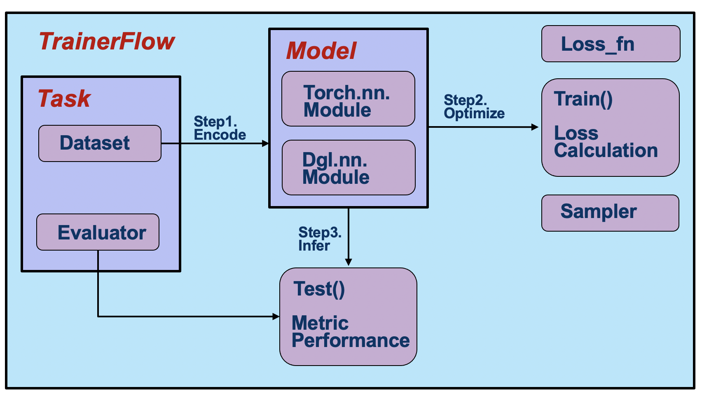

A Pipeline of OpenHGNN
============================

We define three components:
:ref:`pipeline-models`,
:ref:`pipeline-task`,
:ref:`pipeline-trainerFlow`

For release-quality model contributions, use
:doc:`model_pr_checklist` before requesting review.

.. toctree::
   :maxdepth: 2
   :titlesonly:

   task
   model
   trainerFlow
   overview
   model_pr_checklist
