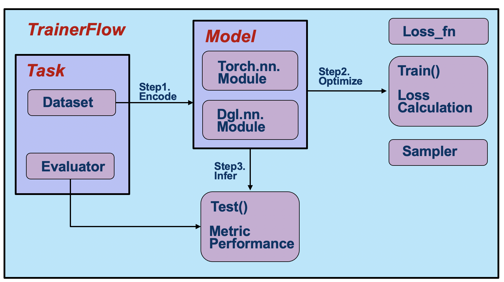

A Pipeline of OpenHGNN
============================

We define three components:
:ref:`pipeline-models`,
:ref:`pipeline-task`,
:ref:`pipeline-trainerFlow`

.. toctree::
   :maxdepth: 2
   :titlesonly:

   task
   model
   trainerFlow