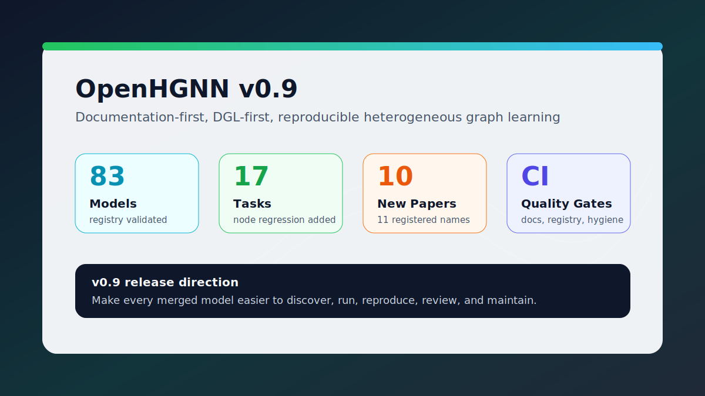
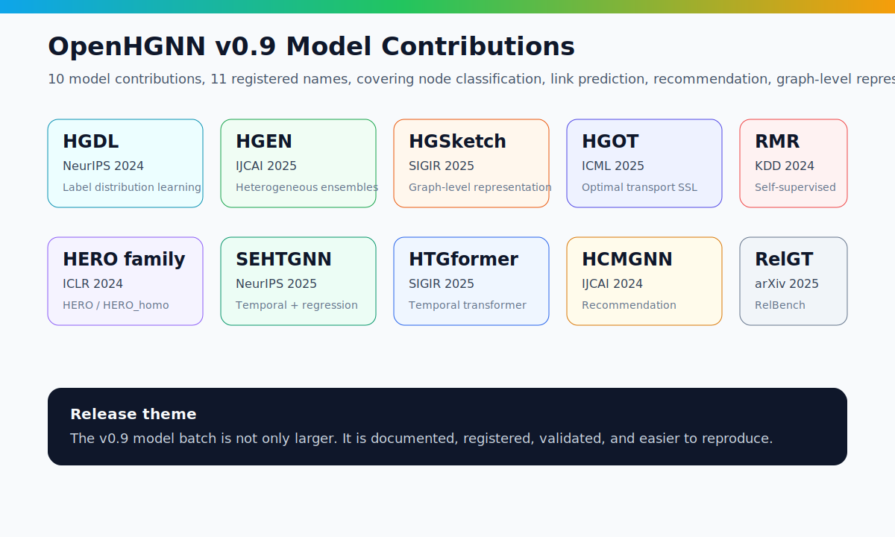

# OpenHGNN v0.9 发布宣传稿



OpenHGNN 现已推出最新的 0.9 版本，欢迎大家从启智社区、GitHub 或通过 pip 下载使用。OpenHGNN 是一个基于 DGL 和 PyTorch 的开源异质图神经网络工具包，面向异质图模型研究、算法复现和下游应用实验，集成了异质图神经网络领域的前沿模型、训练流程、任务接口和数据处理能力。

相比此前版本，OpenHGNN 0.9 不只关注模型数量增长，也更加重视文档完整性、模型接入规范、DGL 原生实现和发布质量门禁。新版本新增 10 个模型贡献，对应 11 个注册模型名；新增 `node_regression` 任务，支持连续值节点标签预测；同时系统更新模型文档、复现指南、任务说明、贡献规范和 CI 检查流程，让用户更容易发现、运行和复现模型，也让贡献者更清楚如何把新算法规范地集成到 OpenHGNN 中。

## 一、新增异质图神经网络模型

OpenHGNN 0.9 版本新增 10 个模型贡献，覆盖异质图表示学习、自监督学习、异质时序图、图级表示、推荐和关系数据建模等方向。这些模型来自 NeurIPS、IJCAI、SIGIR、ICML、KDD、ICLR 等会议或近期预印本工作。其中 `HERO` 和 `HERO_homo` 属于同一 HERO 模型家族，在 OpenHGNN 中注册为两个模型入口，因此本版本是 10 个模型贡献、11 个注册模型名。



| 模型贡献 | 注册模型名 | 会议/来源 | 主要任务 | 简要说明 |
| --- | --- | --- | --- | --- |
| HGDL | `HGDL` | NeurIPS 2024 | 节点分类/标签分布学习 | 面向异质图标签分布学习场景，补充 DBLP/ACM 复现入口。 |
| HGEN | `HGEN` | IJCAI 2025 | 节点分类 | 异质图集成建模方法，支持 DBLP、ACM、IMDB 等数据集。 |
| HGSketch | `HGSketch` | SIGIR 2025 | 图级表示 | 面向更高效的异质图表示学习，目前提供组件级验证和图级表示入口。 |
| HGOT | `HGOT` | ICML 2025 | 节点分类 | 引入最优传输思想的异质图自监督表示学习模型。 |
| RMR | `RMR` | KDD 2024 | 节点分类 | Reserving-Masking-Reconstruction 自监督异质图表示学习方法。 |
| HERO | `HERO`, `HERO_homo` | ICLR 2024 | 节点分类 | 同时提供异质图和同构图版本入口，覆盖多个分类数据集。 |
| SEHTGNN | `SEHTGNN` | NeurIPS 2025 | 节点分类、链路预测、节点回归 | 面向异质时序图的高效模型，也是本版本 `node_regression` 的重要示例。 |
| HTGformer | `HTGformer` | SIGIR 2025 | 链路预测、节点分类、节点回归 | 异质时序图 Transformer 模型，支持 COVID 等时序预测数据。 |
| HCMGNN | `HCMGNN` | IJCAI 2024 | 推荐 | 面向基因、微生物、疾病关联推荐任务。 |
| RelGT | `RelGT` | arXiv 2025 | 关系数据预测 | 面向 RelBench 关系表数据建模，依赖 RelBench/PyG/TorchFrame 等可选组件。 |

这些新增模型让 OpenHGNN 进一步覆盖近期异质图学习的重要方向。更重要的是，v0.9 将模型贡献与文档、复现命令、任务说明和注册表检查结合起来，使模型不仅“进入仓库”，也能被用户通过统一入口发现、运行和验证。

## 二、文档体系更新与复现路径优化

随着 OpenHGNN 模型数量不断增加，用户最常遇到的问题不再只是“库里有没有这个模型”，而是“这个模型怎么安装、怎么运行、用什么数据、指标是多少、失败时该查哪里”。OpenHGNN 0.9 围绕这一问题重新整理了文档入口。

新版本补充了快速开始、模型总览、任务总览、模型复现指南、0.9 release note 和模型 PR checklist。每个 v0.9 新模型的文档都尽量统一到固定字段：论文来源、注册模型名、支持任务、trainerflow、数据来源、预处理方式、运行命令、评估指标、预期结果、硬件/耗时说明和随机种子。用户可以从 README 直接进入模型复现页，也可以从 Sphinx 文档中按任务或模型查找运行方式。

这意味着用户不需要在 README、源码、PR 讨论和输出目录之间来回查找信息。对贡献者来说，新增模型需要补齐哪些材料也更加明确：模型代码、数据接入、配置、README/文档、最小 smoke test 和复现实验说明都成为可检查的发布材料。

## 三、新增 node regression 任务

OpenHGNN 0.9 新增 `node_regression` 任务，用于处理节点标签为连续值的异质图学习问题。相比节点分类任务，节点回归更关注数值预测能力，适用于属性估计、时序数值预测、风险分数预测和回归型下游评估等场景。

在新任务中，模型可以通过统一的 `task`、`dataset` 和 `trainerflow` 接入节点回归流程，数据集侧提供连续值标签，评估侧使用 MAE、RMSE 等回归指标。这样，支持连续值预测的模型不需要在各自 trainer 中重复实现一套回归逻辑，而是可以复用 OpenHGNN 的统一任务入口。

例如，SEHTGNN 可以通过如下命令运行节点回归任务：

```bash
python main.py -m SEHTGNN -d sehtgnn_covid -t node_regression -g 0 --use_best_config
```

`node_regression` 的加入扩展了 OpenHGNN 的任务覆盖范围，使其在节点分类、链路预测、推荐等常见任务之外，也能覆盖更多真实场景中的连续值预测需求。

## 四、DGL-first 的模型接入原则

OpenHGNN 是基于 DGL 和 PyTorch 构建的异质图神经网络工具包，因此 v0.9 更强调 DGL-first 的实现原则。新增模型应优先使用 DGLGraph、DGLHeteroGraph、DGL 采样器、消息传递接口和 `dgl.nn` 组件，尽量复用 OpenHGNN 已有的 `model`、`trainerflow`、`dataset`、`task` 和 `config` 体系。

对于确实需要 NetworkX、PyG、scipy sparse、手写 dense adjacency 或特殊外部依赖的模型，文档中需要明确说明依赖边界和使用原因。例如 RelGT 依赖 RelBench、PyG、TorchFrame 和句向量组件，因此在 release note 中被标注为需要可选依赖环境；HGSketch 目前提供组件级验证，并在文档中说明图级任务支持仍需继续完善。

这一原则的目标不是限制模型实现，而是减少重复图计算代码，提高模型与 DGL 生态的兼容性，让后续采样、训练、评测、CI 和部署能力更容易复用。

## 五、发布质量门禁与贡献规范

OpenHGNN 0.9 的另一个重点是让发布过程更加可验证。新版本加入了 registry validation、PR hygiene check、Sphinx 文档构建、changed-model smoke-test selection 等质量门禁，用于检查模型注册路径、文档构建、仓库卫生和模型变更测试覆盖情况。

这些检查可以提前发现常见问题，例如模型注册路径错误、可选依赖导致包级导入失败、README 缺失、运行产物进入仓库、硬编码本地路径或 GPU、调试代码残留等。对维护者来说，这能减少发布前逐个排查模型入口的成本；对贡献者来说，也能更早知道 PR 还缺什么。

v0.9 还将模型贡献 checklist 写入文档，使新增模型的最低合入标准更加清晰：模型应具备标准注册入口、可说明的数据路径、可执行命令、复现指标、文档说明和最小测试证据。

## 六、推荐环境与安装方式

OpenHGNN 0.9 推荐使用 Python 3.11、PyTorch 2.4.0、DGL 2.4.0+cu121 和 CUDA 12.1。仓库中新增了 `constraints.txt`、`environment.yml` 和 Dockerfile，用于帮助用户构建更稳定的复现环境。

```bash
conda create -n openhgnn-v0.9 python=3.11
conda activate openhgnn-v0.9
pip install -c constraints.txt -r requirements.txt
pip install -e .
```

用户也可以继续从 GitHub、启智社区或 pip 获取 OpenHGNN，并根据文档选择 CPU/GPU 环境和具体模型依赖。

## 结语

OpenHGNN 0.9 的发布目标不是简单堆叠更多模型，而是把模型库从“有代码”推进到“有文档、可运行、可验证、可维护”。我们希望通过更完整的模型文档、更规范的模型接入、更明确的 DGL-first 原则和更稳定的质量门禁，让 OpenHGNN 成为更可靠、更易用的异质图神经网络开源工具包。

欢迎大家继续将自己的异质图算法集成到 OpenHGNN 中。感谢大家一直以来对 OpenHGNN 算法库的支持，我们将持续围绕异质图模型、训练流程、数据集、文档和工程质量进行改进。

GitHub 地址：https://github.com/BUPT-GAMMA/OpenHGNN  
启智社区地址：https://openi.pcl.ac.cn/GAMMALab/OpenHGNN  
Email: wenxuanc@bupt.edu.cn

## 短版宣传语

OpenHGNN v0.9 新增 10 个异质图模型贡献和 `node_regression` 任务，系统更新文档、复现指南、模型贡献规范和 CI 质量门禁，让每个模型更容易被发现、运行、复现和长期维护。
