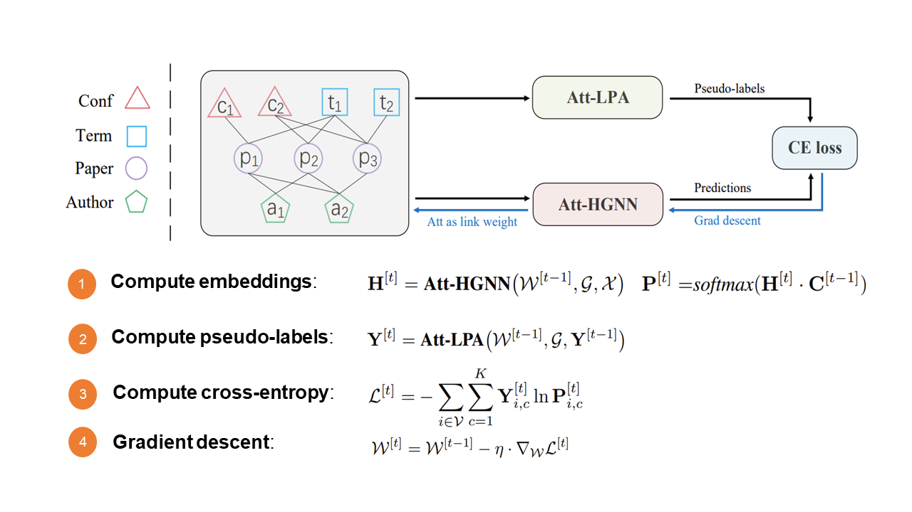

# SHGP[NeurIPS 2022]

Paper: [[SHGP] Self-supervised Heterogeneous Graph Pre-training based on Structural Clustering](https://openreview.net/forum?id=fBU4qsM6Fkf)

Code from author: https://github.com/seongjunyun/Graph_Transformer_Networks



### How to run

Clone the OpenHGNN

```bash
# Run GTN
python main.py -m SHGP -t pretrain -d mag -g 0 --use_best_config
```

If you do not have gpu, set -gpu -1.

##### Candidate dataset: 

openhgnn/dataset/data/mag


### Performance

Node classification

| Node classification(F1 score) | MAG                                                 | 
|-------------------------------|-----------------------------------------------------|
| paper[SHGP]                   | 92.68                                               |
| OpenHGNN[SHGP]                | Macro-F1: 0.9512 (0.0027) Micro-F1: 0.9535 (0.0025) | 

### TrainerFlow: SHGO_trainerflow

The model is pre_trained by SHGP, then evaluated.

#### model

- [transform_relation_graph_list](../../utils/utils.py)
  - Extract a  graph list where every graph just contains a relation.
- [GTLayer](../../models/GTN_sparse.py)
  - Contain GTConv
  - Contain the product of the adjacency matrices of two graphs getting from GTConv.
- [GTConv](../../models/GTN_sparse.py)
  - Create a weighted graph whose adjacency matrix is the sum of the adjacency matrices of the given graph list.

### Dataset

Supported dataset: mag, acm, imdb, dblp

The preprocessed datasets are too large to be posted on GitHub. They can be downloaded from Baidu cloud drive: [https://pan.baidu.com/s/1_EemCZ4XOiIX07JemSTpaA?pwd=shgp](https://pan.baidu.com/s/1_EemCZ4XOiIX07JemSTpaA?pwd=shgp).


### Hyper-parameter specific to the model

You can modify the parameters[SHGP] in openhgnn/config.ini

## More

#### Contirbutor

Yue Min[GAMMA LAB]

#### If you have any questions,

Submit an issue or email to [minyue@bupt.edu.cn](mailto:minyue@bupt.edu.cn).

