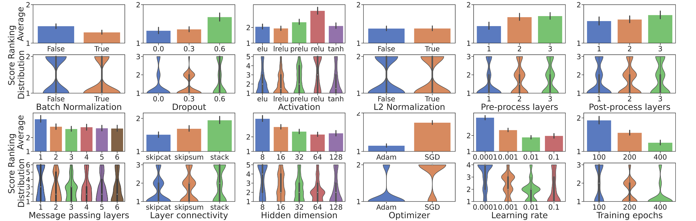
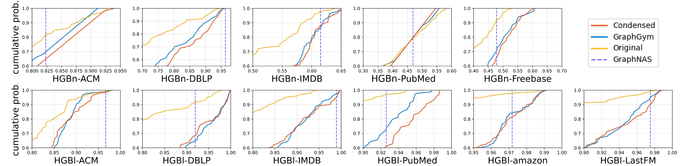

# Design Space for Heterogeneous Graph Neural Network

Paper: [Space4HGNN: A Novel, Modularized and Reproducible Platform to Evaluate Heterogeneous Graph Neural Network](https://arxiv.org/abs/2202.09177)

Following [GraphGym](https://github.com/snap-stanford/GraphGym), we release a platform Space4HGNN for designing and evaluating Heterogeneous Graph Neural Networks (HGNN). It is implemented with PyTorch and DGL, using the OpenHGNN package.

## How to run

### 1 Install

The installation process is same with OpenHGNN [Get Started](https://github.com/BUPT-GAMMA/OpenHGNN#get-started).

### 2 Run a single experiment

#### 2.1 Generate designs randomly

Here we will generate a random design combination for each dataset and save it in a `.yaml` file. The candidate designs are listed in [`./space4hgnn/generate_yaml.py`](./generate_yaml.py).

```bash
python ./space4hgnn/generate_yaml.py --gnn_type gcnconv --times 1 --key has_bn --configfile test
```

``--aggr -a``, specify the gnn type, [and gcnconv, gatconv, sageconv, ginconv are optional].

``--times -t``, the ID of yaml file to control different random sampling.

``--key -k``, specify  a design dimension.

``--configfile -c``, specify a directory name to store configure yaml file.

**Note:**  ``.yaml`` file will be saved in the yaml_file_path which is controlled by four arguments.

```python
yaml_file_path = './space4hgnn/config/{}/{}/{}_{}.yaml'.format(configfile, key, gnn_type, times)
# Here yaml_file_path = './space4hgnn/config/test/has_bn/gcnconv_1.yaml' with the above example code
```

#### 2.2 **Launch an experiment**

```bash
python space4hgnn.py -m general_HGNN -u metapath -t node_classification -d HGBn-ACM -g 0 -r 5 -a gcnconv -s 1 -k has_bn -v True -c test -p HGB
```

``--model -m ``  name of models

``--subgraph_extraction -u`` subgraph extraction methods

``--task -t`` name of task

``--dataset -t`` name of dataset

``--gpu -g`` controls which gpu you will use. If you do not have gpu, set -g -1.

``--repeat -r`` times to repeat, default 5

``--gnn_type -a `` gnn type. 

``--times -t`` same with generating random designs

``--key -k`` a design dimension

``--value -v`` the value of ``key`` design dimension

``--configfile -c  `` load the yaml file which is in the directory configfile

``--predictfile -p`` The file path to store predict files.

e.g.: 

We implement three model families in Space4HGNN, Homogenization model family, Relation model family, Meta-path model family.

For **Homogenization model family**, we can omit the parameter ``--subgraph_extraction``,

```bash
python space4hgnn.py -m homo_GNN -t node_classification -d HGBn-ACM -g 0 -r 5 -a gcnconv -s 1 -k has_bn -v True -c test -p HGB
```

For **Relation model family**, ``--model`` is general_HGNN and ``--subgraph_extraction`` is relation,

```bash
python space4hgnn.py -m general_HGNN -u relation -t node_classification -d HGBn-ACM -g 0 -r 5 -a gcnconv -s 1 -k has_bn -v True -c test -p HGB
```

For **Meta-path model family**, ``--model`` is general_HGNN and ``--subgraph_extraction`` is meta-path

```bash
python space4hgnn.py -m general_HGNN -u metapath -t node_classification -d HGBn-ACM -g 0 -r 5 -a gcnconv -s 1 -k has_bn -v True -c test -p HGB
```

**Note: ** 

Similar with  generating yaml file, experiment will load the design configuration from ``yaml_file_path``. And it will save the results into a `.csv` file in `prediction_file_path`.

```python
yaml_file_path = './space4hgnn/config/{}/{}/{}_{}.yaml'.format(configfile, key, gnn_type, times)
# Here yaml_file_path = './space4hgnn/config/test/has_bn/gcnconv_1.yaml'
prediction_file_path = './space4hgnn/prediction/excel/{}/{}_{}/{}_{}_{}_{}.csv'.format(predictfile, key, value, model_family, gnn_type, times, dataset)
# Here prediction_file_path = './space4hgnn/prediction/test/has_bn_True/metapath_gcnconv_1_HGBn-ACM.yaml'
```

### 3 Run a batch of experiments

An example:

```bash
./space4hgnn/parallel.sh 0 5 has_bn True node_classification test_paral test_paral
```

It will generate  configuration files for the batch of experiments and launch a batch of experiments.

The following is the arguments descriptions:

1. The first argument controls which gpu to use. Here is 0.
2. Repeat times. Here is 5
3. Design dimension. Here is BN.
4. Choice of design dimension. Here set BN `` True``.
5. Task name. Here is nodeclassification
6. Configfile is the path to save configuration files. 
7. Predictfile is the path to save prediction files.

**Note**: 

If you encounter the error ``bash: ./space4hgnn/parallel.sh: Permission denied``, you can try  with cmd ``chmod +x ./space4hgnn/parallel.sh``.

### 3 Analyze the results

#### 3.1 Gather all results

To gather all experiments results, we should run the following command to gather all results into one ``.csv`` file.

```bash
python ./space4hgnn/prediction/excel/gather_all_Csv.py -p ./space4hgnn/prediction/excel/HGB
```

#### 3.2 Analyze with figures

##### 3.2.1 Ranking analysis

We analyze the results with average ranking following [GraphGym](https://github.com/snap-stanford/GraphGym#3-analyze-the-results), the according code is in [`figure/rank.py`](./figure/rank.py).



##### 3.2.2 Distribution estimates

We analyze the results with distribution estimates following [NDS](https://github.com/facebookresearch/nds), and the according code is in [`figure/distribution.py`](./figure/distribution.py).


