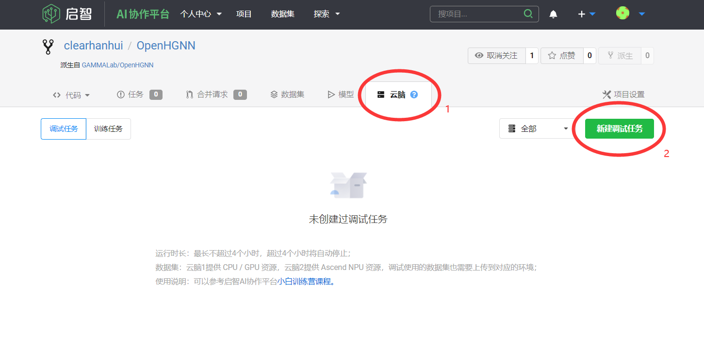
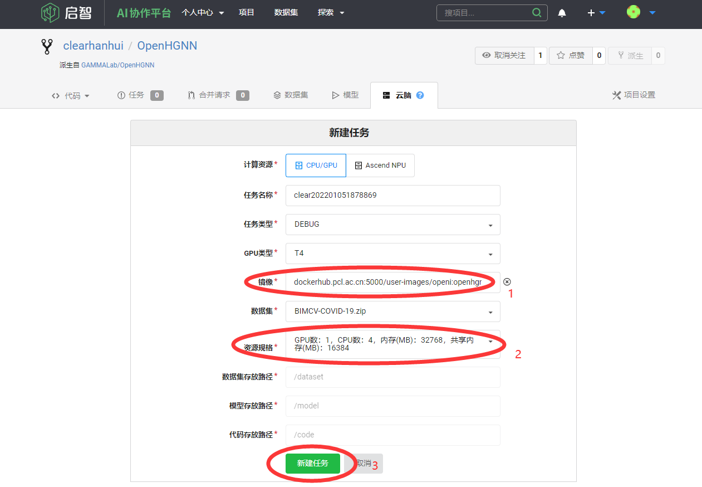
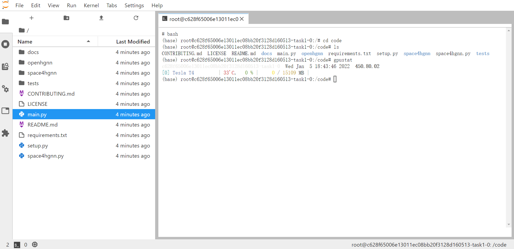

# 使用启智AI协作平台的云脑运行OpenHGNN

本文将介绍如何使用启智社区免费提供给开发者的计算资源来运行OpenHGNN程序。

>参考：关于如何使用启智平台可以参考由启智社区提供的[小白训练营](https://git.openi.org.cn/zeizei/OpenI_Learning)，其详细介绍了关于如何使用启智平台创建项目、同步代码、使用云脑的计算资源等。

本教程基于上述参考资料，实现了OpenHGNN在云脑上运行的相关步骤：

1. 注册并登录OpenI的账号；

2. 在[OpenHGNN的主页](https://git.openi.org.cn/GAMMALab/OpenHGNN)右上角点击“派生”（类似GitHub中的fork），将在自己的空间中创建一个项目拷贝；

3. 进入自己的项目空间的OpenHGNN项目中并切换到“云脑”标签下（默认是处于“代码”标签下），点击右上角按钮“新建调试任务”；

4. 在“镜像”输入openhgnn，并选择提示的镜像；在“资源规格”中选择自己需要的CPU和GPU配置；点击“新建任务”创建一个任务（“任务类型”和“数据集”的设置可以忽略，“任务名称”和“GPU类型”根据需要修改）；

5. 等待创建成功后，点击“调试”，会进入jupyter lab环境中；

6. 可以根据需要修改代码，然后创建一个terminal标签，输入命令`bash`进入bash（默认shell是sh），进入`\code`目录即可运行程序。

**注意事项**

* 运行时长最长不超过4个小时，超过4个小时将自动停止；
* 在jupyter lab中修改的代码不会影响仓库中的代码，可以使用 git commit & push 的方式同步到自己的仓库中；
* 如果需要保存镜像，请不要与openhgnn重名，建议使用“用户名+项目名”的命名方式；
